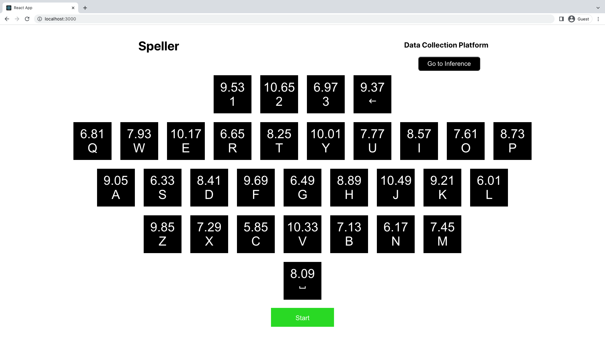
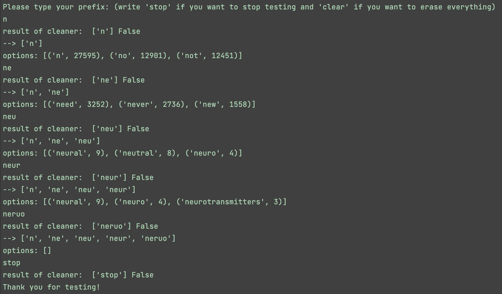

# IRiSSE: Interfaced Recurrences in Steady-State Evocation

In this project, we built a speller that allows users to communicate by shifting their gaze to select characters on a flashing keyboard. It only requires users to be able to move their eyes, which could make it a useful tool for patients with disorders such as Locked-in syndrome or other forms of paralysis. 

Our speller relies on steady-state visually evoked potentials (SSVEPs), a type of signal that can be measured through electroencephalography (EEG). SSVEPs occur with specific types of visual stimuli such as flashing or flickering shapes: neurons in visual areas of the brain are entrained (i.e., their activity becomes synchronized) to the rhythm of the external stimulus. Flashing visual stimuli can thus be differentiated based on their frequencies. 

One of the benefits of SSVEPs is that they are passive signals: the user doesn't need to concentrate or learn how to produce them, which helps make our speller more accessible to various populations. The speller also doesn't require any kind of calibration for new users.

Our speller has a keyboard layout where each key flashes with a different frequency-phase combination. We are able to identify the character the user is trying to select based on their EEG brain signals. We added autocompletion and next-word prediction features to help users type faster. In addition to the speller itself, we also built a data collection interface for recording and labelling EEG data from and SSVEP experiment. Our codebase and raw data are available in this repository. 

## Video presentation of the project

<!-- TODO add YouTube link/thumbnail -->

## Navigating the repository

<!-- TODO add links once merged to main -->

## Overview of the project

*Note*: The subfolders listed above contain more information about each component of the project, as well as instructions for installing and running our software and analyses.

### EEG data collection

We collected data from eleven university students, both male and female, with an 8-electrode setup on the participant’s occipital lobe. The OZ, O1, O2, PO7, PO8, POZ, PO3, and PO4 electrode positions of the 10/20 system were used for data collection (see schematic below). To speed up the EEG setup time and help fix electrodes in place, we marked approximate locations for the eight 10/20 positions of interest on a headband. We placed the headband in a consistent way for all participants, using the inion, the top of the eyebrows and the helices of the pinnae (top of the ears) as landmarks. This way, we avoided having to measure each participant's head dimensions and had a more streamlined data collection process. 

<!-- Figure 1: 10/20 System Schematic -->

Noise was limited to 5-8 microvolts for each electrode by limiting movement of the participant and of others in the vicinity. Data collection conditions were controlled for each participant by using the same electrode placements, positioning the participants around 40 cm from the keyboard display on the screen, and using the same hardware and environment conditions.

### Data collection platform

The data collection interface cued the participant to look at a specific key on the keyboard by highlighting it red. All keys would then flash at their unique frequencies and phases for five seconds. This process iterated randomly through each key on the keyboard with a 200 ms pause in between each one, completing one block of data collection. Data are saved to an Amazon Web Services database in the cloud, which provides easy access to the data from anywhere in the world, as well as scalability to our software. 

We experimented with different frequency configurations, finding that there was a range of frequencies that produced more easily identifiable SSVEP signals. Our final configuration consists of frequencies from 6.00–12.90 Hz incremented by 0.23 Hz, with phases starting at 0 and increasing by 0.35 $\pi$ radians. We mapped each unique frequency-phase pair to a key in our speller, making sure that keys that were physically close to each other would flash at frequencies that are more than 1 Hz apart.

### Signal processing

Electroencephalography (EEG) signals often require processing and filtering before relevant features can be extracted from them.

The main EEG frequencies are delta (0.5 to 4Hz), theta (4 to 7Hz), alpha (8 to 12Hz), and beta (13 to 30Hz). For our speller, visual flashing frequencies of interest lie in the 6-12.9 Hz range, corresponding mostly to alpha waves. The range was chosen after experimentation to maximize frequency spacing between letters while keeping the maximum frequency low to prevent aliasing.

To denoise our signal, we first apply a 60 Hz notch filter to remove the EMG noise. Then, to isolate frequencies of interest, we apply a 2nd order Chebyshev bandpass filter with a ripple of 0.3 dB to the range roughly corresponding to flashing frequencies (5.75-13.15Hz). We tuned hyperparameters to optimize performance. We experimented with signal smoothing and a procedure to reject channels based on an RMS threshold but found no significant performance benefits. In the end, we found only 1 channel is sufficient and best for our purposes.

### Signal classification

We use canonical correlation analysis (CCA) to find the oscillation frequency that most strongly correlates with our signal. The selected channels of the signal are passed into the algorithm with sine and cosine waves at a frequency matching each of the flashing keys. The sinusoid with highest correlation is chosen and the corresponding key is sent to software to be displayed and fed into the language model.

### Autocomplete/next-word prediction

Each time the user selects a letter on the keyboard, the language model gives the top 3 most likely word completions. The model was trained on TV transcripts by learning the frequencies between pairs of words and single words. TV transcripts provide good information for natural language and discussion. 

By incorporating a natural language model into our BCI ecosystem, we are able to increase the speller's information transfer rate and handle errors that would otherwise lead to miscommunication.

### Spelling/inference platform

The spelling interface alternates between flashing periods and prediction periods. During flashing periods, EEG signals are obtained from the biosensing in real time through Lab Streaming Layer (LSL). Once the flashing stops, the collected data are sent to a prediction function which applies any required processing and outputs the prediction obtained by our CCA model. If the predicted character is a letter of the alphabet or a space character, it is appended to the current sentence and displayed in a text box. If the predicted character is the backspace symbol or a number (indicating that the user wants to use the autocomplete feature), the software processes the previously predicted text as appropriate. 

### Limitations and future directions

Although our speller works well and is able to correctly predict the character the user is looking at, it still has some limitations. First, we have found that accuracy increases with higher screen refresh rates: our best results were obtained using an external monitor with a 120Hz refresh rate. Also, a general limitation of SSVEP-based interfaces is that the flashing display may be taxing on the eyes. We have not investigated the effects of fatigue on SSVEP spellers, though accuracy may decrease over time within a session. Moreover, there is a tradeoff between stimulus time and spelling speed: longer stimulus time means more data, which leads to higher accuracy, but it also means that it will take longer for the user to type a sentence.

Future directions would be centered around improving user experience and accessibility. We would like to refine our prediction algorithm since the speller still sometimes makes mistakes. Also, since stimulation time is currently the bottleneck for spelling speed, we would like to improve our prediction model so that it still achieves good performance with less data. For the text prediction feature, one way to improve the language models would be to make them continuously update based the words/sentences previously typed by the user. The models would then potentially be able to learn new words, similar to what some mobile phones do. Finally, on the hardware side, a future direction would be to improve the rendering of the flashing (e.g., reduce lags), which could lower screen refresh rate requirements.

## Partners

* [Building 21](https://building21.ca/)

## About us

We are an interdisciplinary group of dedicated undergraduate students from McGill University and our mission is to raise awareness and interest in neurotechnology, biosignals and human-computer interfaces. For more information, see our [Facebook page](https://www.facebook.com/McGillNeurotech).
