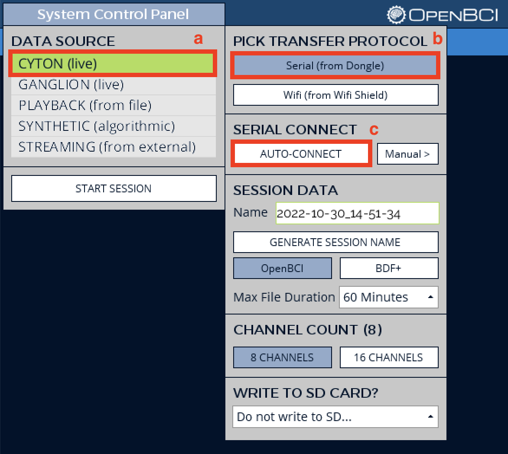
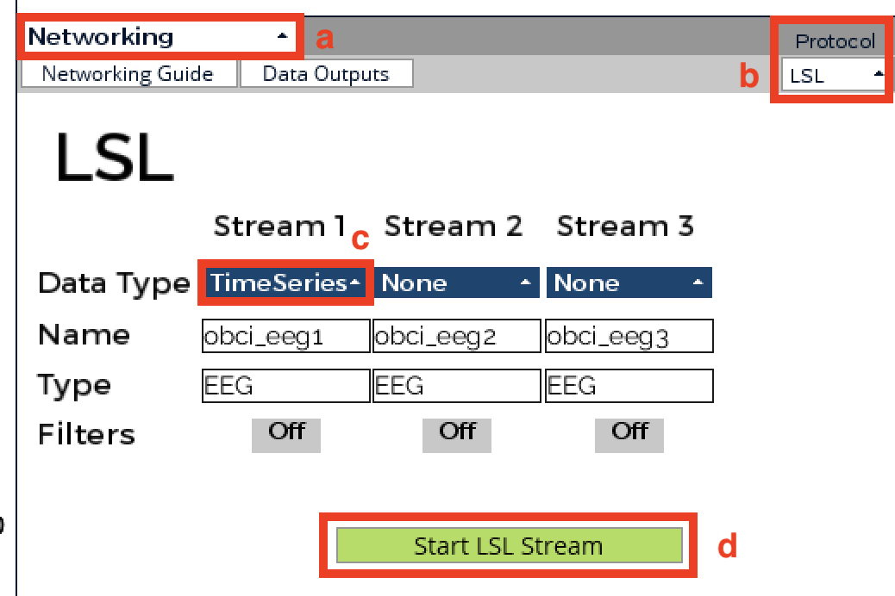

# Data collection

This folder contains the raw EEG data collected by the data collection team. A detailed protocol for setting up EEG electrodes and running the software 
can be found further below. 

Aside from the raw data, this directory contains the following:

* `data_collection_notes.md`: 
    notes taken by members of the data team during data collection sessions. 
    Includes details about the various frequency configurations we used.
* `get_data.py`: 
    a Python script that downloads participant data (raw or preprocessed) from our Amazon Web Services cloud database, reformats them into 4-dimensional matrices, and saves them as `pickle` files.
* `visualization/`: directory containing plots comparing various signal filtering methods, as well as the notebook used to generate the figures (`compare_filters.ipynb`). 

## Accessing the raw data

### Dependencies

* [Python](https://docs.anaconda.com/anaconda/install/index.html) 3.7.6 or later
* [NumPy](https://numpy.org/install/) 1.18.1 or later

Raw EEG data streamed from the OpenBCI GUI are available for 9 participants. EEG data and metadata are stored as Python dictionaries that have been serialized using the `pickle` module. Each `.pkl` file contains a dictionary with the following key-value pairs:

- `data`: 4-dimensional `numpy` array containing the EEG data. The array shape is: `(n_channels, n_samples, n_characters, n_blocks)`. For example, if a participant did 10 blocks of data collection using our 31-character keyboard with an 8-channel EEG device with a sampling frequency of 250 Hz, and if the stimulation duration is 5 seconds, the shape of the data will be `(8, 1250, 31, 10)`.
- `freq_type`: frequency configuration (`A`, `B`, `C`, or `D`). See `data_collection_notes.md` for details about the frequency-phase pairs used in each configuration.
- `freqs`: all frequencies (in Hz) associated with this frequency configuration, sorted in ascending order.
- `chars`: all characters associated with the frequencies in `freqs` (same order).

Each channel always corresponds to the same 10/20 electrode position:
- Channel 1: PO7
- Channel 2: PO3
- Channel 3: O1
- Channel 4: POZ
- Channel 5: OZ (best)
- Channel 6: PO4
- Channel 7: O2
- Channel 8: PO8

Here is an example showing how pickled data can be loaded in Python:

```{python}
import pickle

# this file contains all blocks collected from participant S02 with frequency configuration A
# path assumes working directory is the data directory
path_data = 'raw/S02/S02_typeA.pkl' 

with open(path_data, 'rb') as file:
    data = pickle.load(file)

print(data.keys()) # dict_keys(['data', 'freq_type', 'freqs', 'chars'])
```

## Protocol

### Equipment

* 8-channel [OpenBCI Cyton board and dongle](https://shop.openbci.com/products/cyton-biosensing-board-8-channel)
* Batteries for the BCI board
* 10 wet [electrodes](https://shop.openbci.com/products/openbci-gold-cup-electrodes)
* [Ten20 conductive paste](https://shop.openbci.com/products/ten20-conductive-paste-8oz-jar)
* Elastic headband (approximatively 8cm height)
* Measuring tape
* Paintbrush and fabric paint
* Scissors
* Computer with the following pieces of software installed:
    * OpenBCI Graphical User Interface (GUI) v5.0.4 (other versions may also work)
    * McGill NeuroTech 2021 dashboard (see `software` directory for code and instructions)

### Marking electrode positions on the headband

1. Place the headband on a participant's head, the top of the eyebrows and the helices of the pinnae (top of the ears) as landmarks. Make sure the headband covers the participant's inion, and mark the location of the inion on the headband using paint.

2. Remove the headband. Measure and record the distance between the nasion and the inion ( $d_1$ ) and the distance between the two ears ( $d_2$ ) using a measuring tape.

3. Mark the eight occipital/parietal-occipital electrode placements on the headband using paint. The positions can be determined by constructing a 2x5 grid using $d_1$ and $d_2$ measured in the previous step:
    * The two rows are determined by imaginary curves along 10% and 20% of $d_1$ as measured from the inion.
    * The five columns on the bottom row are determined by imaginary curves along 30%, 40%, 50%, 60%, and 70% of $d_2$ as measured from one of the ears. 
    The three columns on the top row were 40%, 50%, and 60% of $d_2$. 
    * Mark the intersection points corresponding to the Oz, O1, O2, PO7, PO8, POz, PO3, and PO4 electrode positions of the 10/20 system

<!-- TODO screenshot of Yigu video with annotations -->

4. Cut holes below the top row of electrodes on the headband, to allow easier access. 

### Electrode setup

1. Connect the electrode leads to the BCI board. There should be one electrode for each of the eight channels (N1P to N8P), as well as a ground electrode (BIAS pin) and a reference electrode (SRB).

2. Place the headband on the participant's head using the aforementioned landmarks (inion, eyebrows, ears).

3. Fill the electrode cups with conductive paste, then place them on the participant's head so that they are positioned under the paint marks. For the top row, thread the electrodes through the holes in the headband.

4. Place the ground and reference electrodes on the participant's earlobes.

<!-- Electrode positions were located by first measuring the distance between the nasion and the inion ($d_1$) and the distance between the two ears ($d_2$) using a measuring tape. The eight occipital electrode placements consisted of two rows, five on the bottom and three on the top. The two rows were marked by imaginary curves along 10% and 20% of d1 as measured from the inion. The five columns on the bottom row were marked by imaginary curves along 30%, 40%, 50%, 60%, and 70% of $d_2$ as measured from one of the ears. The three columns on the top row were 40%, 50%, and 60% of $d_2$. The electrodes were placed at the eight intersection points along the rows to achieve the Oz, O1, O2, PO7, PO8, POZ, PO3, and PO4 electrode positions of the 10/20 system. -->

<!-- To collect data from a participant, we first set up the necessary software. This included streaming live data using the OpenBCI GUI and opening the front and back ends. Meanwhile, the headband was placed on the participant's head using the aforementioned landmarks. The electrodes were then threaded through specific holes in the headband correlating to measured locations on the participant's head according to the 10/20 system. Two electrodes were additionally placed on both of the participant's ear lobes as the reference and bias electrodes. Figure 2 displays a sample electrode placement on one of the participants. -->

<!--  -->

<!-- Figure 2: Sample Electrode Set-Up -->

### Setting up the OpenBCI GUI

1. Turn on the Cyton board and plug the USB dongle to the computer.

2. Launch the OpenBCI GUI.

3. To start a session, select **LIVE (from Cyton)** > **Serial (from Dongle)** > **AUTO-CONNECT**.



4. Click **Start Data Stream** in the top right corner of the GUI.

5. Choose **Networking** for one of the widgets. In the dropdown **Protocol** menu, select **LSL**. Under **Stream 1**, set the **Data Type** field to **TimeSeries**, and click **Start LSL Stream**. 



### Data quality control

1. Start the EEG data stream using the OpenBCI GUI (**Start Data Stream**). 

2. Make sure the channels are not railed or noisy. We aimed for a RMS of 5-8 microvolts for each electrode. 

3. To avoid noisy data, limit movement of the participant and of others in the vicinity. 

4. Position the participant around 40 cm from the screen.

### Using the data collection web app

<!-- To start the software, use the command line to navigate to the `software` directory, then run `./start_prod.sh`. This will start the backend and the frontend components of the web application.  -->
1. Start the software following the instructions in the `software` directory. A new tab should pop up automatically in your browser, with `localhost:3000` in the address line.

2. Type the participant's ID in the **Collector name** text box, then click the **Start** button. This will start a round of data collection, iterating through each of the 31 keys to collect one block of data.

### Running the speller

The setup is exactly the same as for data collection, except we use the "Inference" page of the web application.

<!-- TODO screenshot -->
