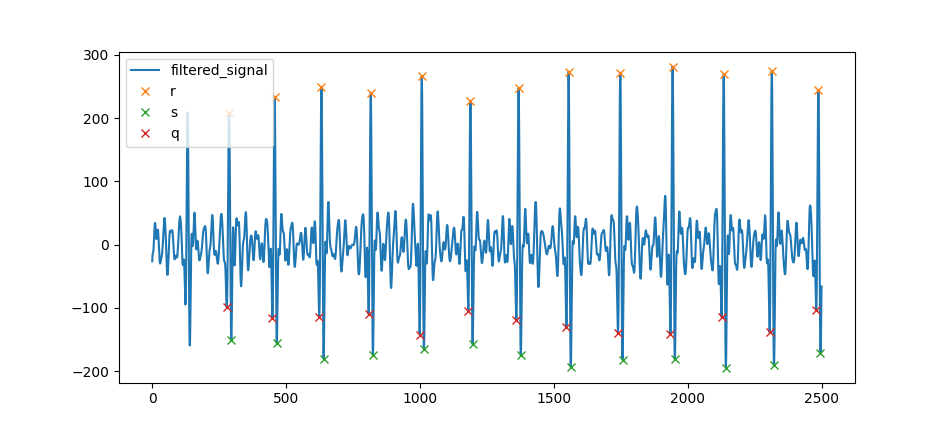

# Signal Processing

## Dependencies
- [Python 3.8.5](https://www.python.org/downloads/) or later
- [Numpy 1.19.3](https://numpy.org/) or later ``pip install numpy``
- [Matplotlib 3.3.2](https://matplotlib.org/) or later ``pip install matplotlib``
- [MNE 0.22.0](https://mne.tools/stable/index.html) or later ``pip install mne``
- [Scipy 1.5.3](https://www.scipy.org/) or later ``pip install scipy``

## EEG and ECG Signals
In this project we use EEG (electroencephalogram) and ECG (electrocardiogram) signals to monitor the mood and behaviour of our users / patients.

[See 2020 code for inspiration on writing this readme](https://github.com/NTX-McGill/NeuroTechX-McGill-2020/tree/main/offline/signal_processing)

### ECG

**peak detectiction** algorithm

### EEG

## Code
``example_code/`` contains a jupyter notebook ``numpy and mne filtering examples.ipynb`` that shows you how to filter signals with mne library. There is also a numpy implementation but it doesn't seem to be doing a good job - someone will have to fix this. Also contains ``plot_all_spectrograms.py``: some informative code from 2019.

Note: it's bad form to push jupyter notebooks, should we move this to google colab along with the 2019 data?. 

``filter.py``, this filters ECG data. The code here can be built upon so that it filters all channels of data. 

``featurize.py``, requires ``filter.py``, filters signals and extracts featurse from them for ML to play with

``signal_class.py`` is a class for processing our *offline* data: ECG and EEG signals, contains methods from ``filter.py`` and ``featurize.py``. Keep this file tidy and well organized, the first time you implement an algorithm don't do it in here, test it somewhere else beforehand.

## Todo
- [x] Improve ``filter.py`` so that it filters EEG as well as ECG -- watch out we will probably need to use a different frequency band for the EEG signals than the 8Hz to 20Hz band we use for ECG
- [ ] Implement filters in numpy, see [2020](https://github.com/NTX-McGill/NeuroTechX-McGill-2020/blob/main/offline/signal_processing/filtering.py) and [2019](https://github.com/NTX-McGill/NeuroTechX-McGill-2019) code 
- [ ] Research: Look into what the mne and mne-realtime libraries have to offer, we may not have to code everything ourselves if we can make use of these efficiently.
- [ ] Start featurizing:
    - [ ] Implement [peak detection algorithm](https://www.sciencedirect.com/science/article/pii/S2212017312004227) (I made a really basic one, but we need a better one, this one is not fool-proof in featurize)
    - [ ] basic time domain HRV (heart-rate variability) feature (keep in mind we'll have to make this a real-time feature, think about this when you design it) 
    - [ ] Pointcare plots for nice visual display of HRV
    - [ ] Frequency domain HRV stuff
    - [ ] Look into wavelet transforms - maybe this is not great because our ECG data isn't so clean  
- [ ] Research : spectrograms can be fed into computer vision algorithms, research + think of ways we could implement spectrograms over not-too-long time periods
- [ ] Make class for signal processing for nicer, readable code

[see this link info on hrv analysis](https://imotions.com/blog/heart-rate-variability/#hrv-analysis)
