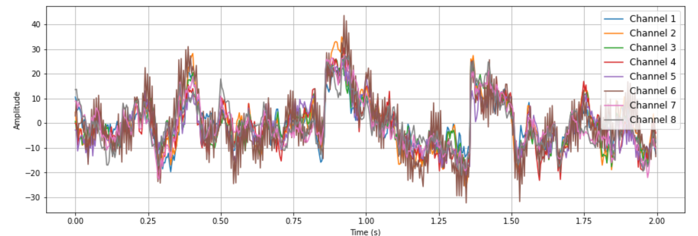
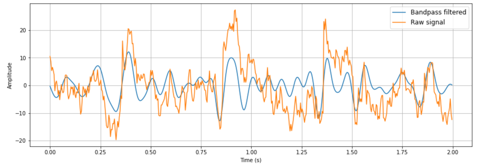

# Signal Processing

## Dependencies:
* [Python 3.7.6](https://www.python.org/downloads/) or later
* [Numpy 1.18.1](https://numpy.org/) or later
* [Matplotlib 3.1.3](https://matplotlib.org/) or later
* [Scipy 1.4.1](https://www.scipy.org/) or later

## Filtering

Electroencephalography (EEG) signals often require processing and filtering before relevant features can be extracted from them.

The main EEG frequencies are delta (0.5 to 4Hz), theta (4 to 7Hz), alpha (8 to 12Hz), and beta (13 to 30Hz). For our speller, visual flashing frequencies of interest lie in the 6-12.9 Hz range, corresponding mostly to alpha waves. The range was chosen after experimentation to maximize frequency spacing between letters while keeping the maximum frequency low to prevent aliasing.

To denoise our signal, we first apply a 60 Hz notch filter to remove the EMG noise. Then, to isolate frequencies of interest, we apply a 2nd order Chebyshev bandpass filter with a ripple of 0.3 dB to the range roughly corresponding to flashing frequencies (5.75-13.15Hz). We tuned hyperparameters to optimize performance. We experimented with signal smoothing and a procedure to reject channels based on an RMS threshold but found no significant performance benefits. In the end, we found only 1 channel is sufficient and best for our purposes.

## Canonical Correlation Analysis

We use canonical correlation analysis (CCA) to find the oscillation frequency that most strongly correlates with our signal. The selected channels of the signal are passed into the algorithm with sine and cosine waves at a frequency matching each of the flashing keys. The sinusoid with highest correlation is chosen and the corresponding key is sent to software to be displayed and fed into the language model.

 
<!--  -->

### Remarks
* `predict.py` takes live streamed EEG data and outputs a predited letter
* `standard_CCA.py` contains code for the CCA algorithm used for inference (other CCA files are not used in production)
* `Experiments_scripts/` contain supplemental experiments and investigations, including code profiling, RMS-rejection, and building a template
* `eyeblink/` contains a computer vision program to detect blinks and double blinks to erase characters (currently unused)